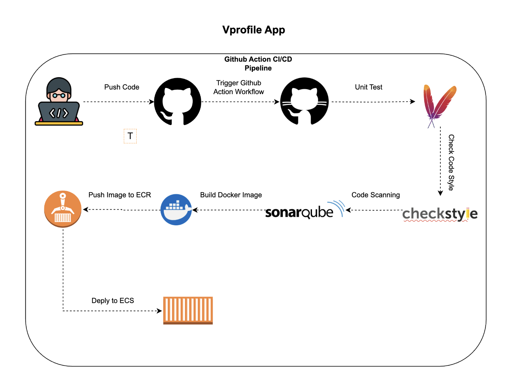

# 🚀 Vprofile App – GitHub Actions CI/CD

This repository includes a **GitHub Actions** workflow named **`Vprofile Actions`** to build, test, analyze, containerize, and deploy the Vprofile application to **AWS ECS** with images stored in **ECR** and configurations updated dynamically (including RDS for MySQL).

---


## 📌 Architecture Diagram

  

The diagram above illustrates the workflow steps from code push to production deployment.

---

## 📌 Workflow Overview

The workflow is defined in [`.github/workflows`](.) and can be triggered manually via **`workflow_dispatch`** and Push Event.

**High‑level flow:**

1. **Testing Stage**  
   - Checks out the code.  
   - Runs unit tests with `mvn test`.  
   - Runs **Checkstyle** for static code analysis.  
   - Runs **SonarCloud** scan and waits for **Quality Gate** results.  
   - Fails early if the quality gate is not passed.  

2. **Build and Push Stage**  
   - Updates `application.properties` with **RDS** credentials and endpoint from GitHub Secrets.  
   - Builds the Docker image for the app.  
   - Pushes the image to **Amazon ECR** with tags:  
     - `latest`  
     - The GitHub run number for traceability.  

3. **Deploy Stage**  
   - Configures AWS credentials (from secrets).  
   - Updates the ECS Task Definition with the new image.  
   - Deploys the updated task definition to **Amazon ECS**.  
   - Waits for service stability before completing.

---

## Architecture

| Step | Description | Tool/Service |
|------|-------------|--------------|
| Code Checkout | Fetch source | `actions/checkout` |
| Unit Tests | Run `mvn test` | Maven + Surefire |
| Static Analysis | Checkstyle + SonarCloud | `mvn checkstyle:checkstyle`, Sonar |
| Container Build | Docker image build | Docker |
| Artifact Registry | Store image | Amazon ECR |
| Deployment | Update ECS task definition and deploy | Amazon ECS |

---

## Required GitHub Secrets

Before running this workflow, set the following secrets in your repository settings:

| Secret | Purpose |
|--------|---------|
| `AWS_ACCESS_KEY_ID` | AWS IAM user key with ECR/ECS permissions |
| `AWS_SECRET_ACCESS_KEY` | AWS IAM user secret |
| `REGISTRY` | Your AWS ECR registry URI (e.g., `123456789012.dkr.ecr.us-east-1.amazonaws.com`) |
| `SONAR_URL` | SonarCloud host URL |
| `SONAR_TOKEN` | SonarCloud authentication token |
| `SONAR_ORGANIZATION` | SonarCloud organization key |
| `SONAR_PROJECT_KEY` | SonarCloud project key |
| `RDS_USER` | MySQL RDS username |
| `RDS_PASS` | MySQL RDS password |
| `RDS_ENDPOINT` | MySQL RDS endpoint (host) |
| `cache` | Optional: Docker layer cache (if used) |

---

## Environment Variables

These are defined at the top of the workflow:

| Variable | Default Value | Purpose |
|----------|---------------|---------|
| `AWS_REGION` | `us-east-1` | AWS region for ECS/ECR |
| `ECR_REPOSITORY` | `vprofile-app` | ECR repository name |
| `ECS_SERVICE` | `vprofile-app-task-service` | ECS Service name |
| `ECS_CLUSTER` | `vproapp` | ECS Cluster name |
| `ECS_TASK_DEFINITION` | `aws-files/taskdeffile.json` | ECS task definition template |
| `CONTAINER_NAME` | `vproapp` | Container name in task definition |


---

## 📂 Workflow File Structure

```
.github/
└── workflows/
    └── vprofile-actions.yml   # Main workflow file
aws-files/
└── taskdeffile.json          # ECS task definition template
src/
└── main/resources/application.properties
Dockerfile
pom.xml
```


